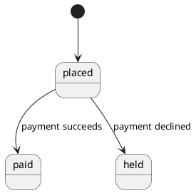

# State machine

A state machine is a derived node: one per [entity](./entity.md) that any
[requirement](./requirement.md) `transition` names as subject. It is never written
directly, and there is no write tool for it. On every commit the store recomputes each
subject's machine from the transitions, exactly as relationships are recomputed from
edges. See [derived data](../graph.md#derived-data).

The shape, stored in `graph/state-machines.yaml`:

```yaml
sm:order:
  subject: ent:order
  states: [placed, paid, held]
  initial: placed
  transitions:
    - {from: placed, to: paid, trigger: payment succeeds, requirement: req:shop-7}
    - {from: placed, to: held, trigger: payment declined, requirement: req:shop-8}
```

- The map key is the id: `sm:<entity-slug>`, the subject's slug. See
  [identifiers](../model.md#identifiers).
- `subject`: the entity whose lifecycle this is.
- `states`: the union of the names the transitions use.
- `initial`: the state no transition enters, when exactly one exists.
- `transitions`: `[{from, to, trigger?, guard?, requirement}]`, one per contributing
  requirement. Every transition carries its requirement, so every arrow walks to a
  sentence.

## Derivation

On every commit, after the changeset lands:

- Every requirement whose `transition.subject` is the entity contributes one transition.
  The gates guarantee the subject is listed in the requirement's `entities` and exists.
- State names compare after trimming, lowercasing, and collapsing whitespace. The stored
  spelling is the first occurrence in document order.
- `initial` is the state with no incoming transition when exactly one such state exists.
  With none or several, `initial` is absent.
- Transitions are ordered by requirement id, so the shard diffs cleanly.
- A machine whose last transition disappears is removed. Nothing retraces it: the default
  `state` view that renders it is removed at the same commit, and a curated `state` or
  `timing` view over the subject renders without it.
- A machine over `states-per-state-machine` (12 soft, 20 hard) is the
  `threshold-crossed` change and opens [`abstract-entity`](../goals/abstract-entity.md)
  on the subject, since the machine derives from the subject's requirements. A bump in
  the subject's `limits` raises the threshold. See [limits](../graph.md#limits).

A transition with `from` equal to `to` is a handled event that leaves the state as it is.
A `guard` is free text the model wrote to distinguish transitions; the harness compares
guards as text and never evaluates them.

## Checks

The machine checks run on every derived machine at the end of every build and on
`jazyk check`. They file diagnostics with the subject entity among the `subjects`, update
them in place while the condition holds, and resolve them when it clears. See
[checks](../compilation.md#checks).

- `unreachable-state` (warning): a state no path from the initial state reaches. With
  several candidate initial states, reachability is computed from all of them jointly.
  With no candidate (every state has an incoming transition), the check does not fire.
  One diagnostic per machine, the message naming the states.
- `dead-end-state` (info): a state with no outgoing transition. It is the subject's final
  state or a requirements gap; a human acknowledges the former. One diagnostic per
  machine, the message naming the states.
- `nondeterministic-transition` (warning): two transitions out of one state on the same
  trigger with overlapping guards. Guards overlap when either transition has none or when
  both guards are equal after normalization. Two distinct guards are taken as disjoint,
  because the model wrote them to distinguish the transitions. One diagnostic per pair,
  the two requirements as subjects.
- `unhandled-event` (info): an event the subject's requirements name that some state does
  not handle. The event set is the union of the machine's triggers. A pair (state,
  trigger) with no transition out of that state on that trigger, self-transitions
  included, is unhandled. The check is silent on a machine with fewer than two
  transitions: with one arrow, every other state is a trivially unhandled dead end
  that `dead-end-state` already reports. One diagnostic per machine, the message
  listing the pairs. An
  unhandled pair is a requirements gap detector: the documents say what happens on payment
  success in `placed` and say nothing about it in `held`.

The checks are deterministic and file no judgment. Whether a dead end is final or a gap,
and what an unhandled event should do, are questions for the document owner, asked
through the diagnostic and answered in prose.

## Rendering

- The `state` view kind renders the machine: `[*] --> <initial>` when the machine has an
  initial state, then one arrow per transition from `from` to `to`, labeled with the
  trigger and the guard in brackets. A machine with no initial state draws no `[*]` arrow.
  One `state` view derives per machine by default. See
  [default views](./view.md#default-views).
- The `timing` view kind reads the machine plus the subject's `quality` requirements that
  carry a time `measure`: the lane shows the states the measure governs. Timing views are
  curated, never default; one over a subject with no time measure draws the lane with no
  marks. See [kinds](./view.md#kinds).
- The `activity` view kind reads transitions among its members for branch labels.

E.g. the machine above renders as:



The output lands at `<out>/diagrams/state/<slug>.puml` with its `.svg` beside it. See
[the emitters](../diagrams.md#the-emitters) and
[output layout](../diagrams.md#output-layout).
