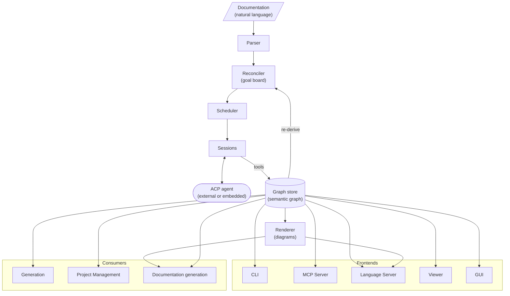

# Jazyk

[jazyk.org](https://jazyk.org)

Natural language as a programming language.

## Preamble

Natural language or ordinary language is any language that humans use to communicate
amongst each other. This project introduces a new higher-level programming language that
allows developers to define software in natural language.

Compared to common programming languages, natural language is flexible and allows for a
wide range of interpretations, making it difficult to define and construct software
out of it, if not properly constrained.

The syntax of natural languages such as English is already defined. Rather than constraining
it, we introduce a compiler that surfaces ambiguity, open-endedness, and contradictions in
its usage.

### Read-eval-print loop

In the current world, LLMs are invoked with short and well-defined prompts to produce more
reliable outcomes.

An open-ended prompt becomes exponentially less reliable
(e.g. "pelican on bicycle as SVG", "build me Facebook").

What if open-endedness is not the target we are aiming for?

Programming languages are constrained by their syntax and semantics. The English language
can describe ambiguity. The prompts are unreliable because we are using natural language
with ambiguity.

In a way, a coding agent (e.g. Claude Code) is a form of REPL, a way to interact with an
LLM one statement at a time to produce an incremental result.

If a coding agent is a REPL, and a prompt is a single programming statement, then what does
an entire program look like?

Disregard the flexibility of natural language to produce ambiguous statements. There is no
CPU instruction to "build me a Facebook" or "draw me a pelican", so let's restrict our
language to be well-defined.

Imagine a requirements doc and UML diagrams as a programming language.

## How it works

The compiler maintains a persistent [semantic graph](./compiler/model.md) reconciled
against the documentation. Three authored kinds live in the
[graph store](./compiler/graph.md): entities, requirements (free-form
[statements](./compiler/concepts/statements.md), each with a verbatim quote as its
provenance), and [views](./compiler/model/view.md) (what one diagram includes).
Relationships, state machines, and default views derive from them on every commit. The
graph is edited in place across builds, never regenerated. Every fact carries
[provenance](./compiler/model.md#provenance): a verbatim quote, a derivation from
upstream facts, or a human decree. A derived or decreed fact carries a proposal for the
sentence the documents should gain, so the graph converges toward fully quoted.

The graph is the build artifact, and compilation is a goal board. The deterministic
[reconciler](./compiler/reconciler.md) derives goals from the documents, the graph, and
the change records earlier commits left behind. A [session](./compiler/sessions.md), one
LLM session per goal batch over a bounded [loaded set](./compiler/context.md) of the
graph, resolves them with tools and justifies each resolution. Goals come in two
classes. Compile goals bring the graph in line with the documents. Garbage collection
(GC) goals restructure it (splitting dense entities and views, declaring edges, merging
lookalikes) once the neighborhood they target has settled. A build interleaves the two
classes in bursts until it [converges](./compiler/compilation.md#convergence). A
rebuild with no changes derives zero goals and makes zero LLM calls.

Diagrams are projections. Every UML diagram kind renders from the graph on every commit
([diagrams](./compiler/diagrams.md)): there are no diagram elements, only facts and
views, so a picture cannot drift from the documents behind it. Downstream consumers work
the same way: they query the graph one entity, one requirement, or one view at a time,
staying in the small-prompt regime where LLMs are reliable.

Entities nest in one containment tree, every level of the tree gets its own diagrams,
and digging into an entity shows the level below it ([levels](./compiler/concepts/levels.md)).

## Architecture

## Compiler

The compiler reconciles the documentation into the semantic graph, surfaces ambiguity,
open-endedness, and contradictions as diagnostics along the way, and draws every view
as a diagram.

[See more](./compiler/compiler.md)

## Benchmark

The benchmark grades whether a given [agent](./frontends/acp.md#agents) and model are
capable of powering compilation.

[See more](./benchmark/benchmark.md)

## Frontends

Frontends embed the compiler and expose the graph to different consumers.

- [CLI](./frontends/cli.md)
- [ACP Bridge](./frontends/acp.md)
- [MCP Server](./frontends/mcp.md)
- [Language Server](./frontends/lsp.md)
- [Viewer](./frontends/viewer.md)
- [GUI](./frontends/gui.md)

## Consumers

Consumers work from the graph to do useful work downstream.

- [Generation](./consumers/gen.md)
- [Binding](./consumers/bind.md)
- [Decompilation](./consumers/decompile.md)
- [Project Management](./consumers/pm.md)
- [Documentation generation](./consumers/docsgen.md)
