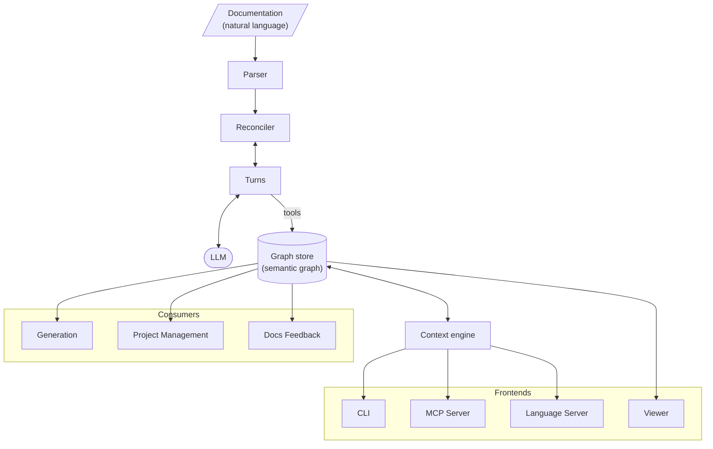

# Jazyk

[jazyk.org](https://jazyk.org)

Natural language as a programming language.

## Preamble

Natural language or ordinary language is any language that humans use to communicate
amongst each other. This project introduces a new higher-level programming language that
allows developers to define software in natural language.

Compared to common programming languages, natural language is flexible and allows for a
wide range of interpretations, making it difficult to define and construct software
out of it, if not properly constrained.

The syntax of natural languages such as English is already defined. Rather than constraining
it, we introduce a compiler that surfaces ambiguity, open-endedness, and contradictions in
its usage.

### Read-eval-print loop

In the current world, LLMs are invoked with short and well-defined prompts to produce more
reliable outcomes.

An open-ended prompt becomes exponentially less reliable
(e.g. "pelican on bicycle as SVG", "build me Facebook").

What if open-endedness is not the target we are aiming for?

Programming languages are constrained by their syntax and semantics. The English language
can describe ambiguity. The prompts are unreliable because we are using natural language
with ambiguity.

In a way, a coding agent (e.g. Claude Code) is a form of REPL, a way to interact with an
LLM one statement at a time to produce an incremental result.

If a coding agent is a REPL, and a prompt is a single programming statement, then what does
an entire program look like?

Disregard the flexibility of natural language to produce ambiguous statements. There is no
CPU instruction to "build me a Facebook" or "draw me a pelican", so let's restrict our
language to be well-defined.

Imagine a requirements doc and UML diagrams as a programming language.

## How it works

The compiler maintains a persistent [semantic graph](./compiler/model.md) reconciled
against the documentation. Entities, EARS requirements, derived relationships, and
diagnostics live in the [graph store](./compiler/graph.md), edited in place across builds,
never regenerated.

The graph is the build artifact. Every change to it happens in a [turn](./compiler/turns.md):
one small, well-defined LLM session over a bounded [context pack](./compiler/context.md),
scheduled by the deterministic [reconciler](./compiler/reconciler.md). Downstream consumers
work the same way: they query the graph one entity or one requirement at a time, staying in
the small-prompt regime where LLMs are reliable.

## Architecture

## Compiler

The compiler reconciles the documentation into the semantic graph and surfaces ambiguity,
open-endedness, and contradictions as diagnostics along the way.

[See more](./compiler/compiler.md)

## Benchmark

The benchmark grades whether a given model is capable of powering compilation, under both
[codecs](./compiler/turns.md#codecs).

[See more](./benchmark/benchmark.md)

## Frontends

Frontends embed the compiler and expose the graph to different consumers.

- [CLI](./frontends/cli.md)
- [MCP Server](./frontends/mcp.md)
- [Language Server](./frontends/lsp.md)
- [Viewer](./frontends/viewer.md)

## Consumers

Consumers work from the graph to do useful work downstream.

- [Generation](./consumers/gen.md)
- [Project Management](./consumers/pm.md)
- [Docs Feedback](./consumers/docsgen.md)
