# Plan: the IR graph

Status: proposal for iteration. Read with [ir-stages](./ir-stages.md) (doctrine,
compile and GC), [agent](./agent.md) (goals and sessions),
[ripple](./ripple.md) (propagation and observing), [orchestration](./orchestration.md)
(implementation notes).

## Three authored kinds

The graph stores three kinds of authored semantic content, and derives the rest:

| id | kind | authored or derived | natural key |
|---|---|---|---|
| `ent:<slug>` | entity | authored | name + scope |
| `req:<doc-stem>-<n>` | requirement | authored | source section + statement |
| `view:<kind>/<slug>` | view | authored (defaults derived) | kind + title |
| `rel:<a>~<b>` | relationship | derived from requirement edges | member pair |
| `sm:<entity-slug>` | state machine | derived from requirement transitions | subject entity |
| `sec` | section | structural | document path |
| `diag:<rule>-<n>` | diagnostic | judgment record | rule + subjects |

Everything that was a candidate for its own kind is an entity with a stereotype
or a derivation:

- A component is an entity («service», «container», whatever the model judges
  the medium calls it), with containment through `parent` and its contracts
  through relationships. Its requirements attach directly, which is the point: no
  separate allocation machinery, the statements are already on the node.
- An interface is an entity («interface»). Its operations are requirements on
  it ("the checkout API shall accept a cart and return an order"); provided and
  required are relationship types (below).
- An instance is an entity tied to its type by an `instantiation` relationship,
  its values on `attributes`. Conformance stays checkable.
- A use case is a view: an ordered set of requirements (the flow) whose
  entities give the participants. An interaction is the same view rendered as a
  sequence.
- A decision is a diagnostic with a `prompt` (rule `decision`): question,
  options, human answer, triage, all existing machinery. A decision the docs
  state is not a node at all; it is prose, extracted like any other statement.
- A state machine is derived data: requirements carry `transition` facets, the
  store recomputes each subject's machine on commit, exactly as relationships
  are recomputed from edges. No write tool.

The payoff of the collapse: an entire class of consistency checks disappears
because the duplication they guarded is gone. There is no "message must name an
operation the interface provides" check when the message and the operation are
the same requirement.

## Provenance

Every fact carries exactly one provenance:

- `quote`: extracted from prose. `{doc, section, quote}`, verbatim, located
  whitespace-insensitively. Dies when its section text changes.
- `derived`: synthesized from upstream nodes. `{from: [ids], reasoning}`.
  Invented until ratified: docsgen proposes the sentence, the owner accepts,
  the next reconcile flips it to `quote`.
- `decree`: authored by a human directly on the graph. `{author, at, note?}`.
  Outranks derivation, not the documents: contradicting prose draws a
  diagnostic, and ratification proposals stand until the decree is written into
  the docs or retracted.

The graph never holds a fact that cannot say where it came from, and
ratification pressure pushes every fact toward `quote`.

## Entity

- `name`, `aliases`, `definition`, `mentions` (each with a verbatim quote),
  `scope` (bounded context).
- `stereotype`: a free-form judged label («system», «service», «interface»,
  «actor», «table», «character», «department»). One field carries what would
  otherwise be a node kind per concept; nothing enumerates the allowed values.
- `parent`: the containing entity, one tree, unlimited depth: a system contains
  services, a service contains modules, a module contains its domain concepts,
  a database its tables. See [containment and lifting](#containment-and-lifting).
- `attributes`: `{name, type?, value?, provenance}`. Types where prose states
  structure ("an order carries a total and a currency"); values where the
  entity is an instance ("priced in EUR"). Behavior is never an attribute; it
  is a requirement.

## Requirement

One atomic obligation, free-form. The model writes the statement in whatever
wording carries it best; extraction guidance points at clarity (specific,
testable, entity-anchored) without prescribing a syntax.

- `statement`: the text. `source`: `{doc, section, quote}`, verbatim.
- `entities`: what it is about, at least one. Multi-entity statements are
  encouraged: they are what makes the graph a graph.
- `edges`: the relationships this one statement causes, plural. "System A calls
  system B's API endpoint" yields `A→endpoint dependency` and `A→B dependency`
  at once; one sentence, several arrows. Each edge is
  `{a, b, type?, cardinality?}`, directional (a acts on b), cardinality from
  `1`, `0..1`, `1..*`, `*`. A multi-entity requirement with no edges draws the
  `declare-edges` goal.
- `transition`: an optional judged facet,
  `{subject, from, to, trigger?, guard?}`, when the statement describes a state
  change ("when payment succeeds, the order becomes paid"). This is the state
  machine's source.
- Facets (behavior, constraint, failure mode, quality attribute) are judgments
  recorded at extraction with reasoning. A quality requirement with no
  measurable bound draws a warning.

## Relationship (derived)

Recomputed from requirement `edges` on every commit; no write tool, so an edge
cannot exist without a statement behind it. One node per unordered pair,
contributions grouped by direction and type: a pair can carry
`a→b dependency` and `a→b association` and `b→a dependency` side by side, each
group with its own contributing requirements and cardinality. Rendering draws
one arrow per group; collapsed and lifted arrows show the strongest type with a
count.

Types, the UML set: `generalization`, `realization`, `composition`,
`aggregation`, `association`, `dependency`, `instantiation`. They cover what
dedicated kinds would otherwise encode: provides is `realization` toward an
«interface» entity, requires is `dependency` toward one, is-instance-of is
`instantiation`.

## State machine (derived)

One per entity that any `transition` facet names as subject, recomputed on
commit: states are the union of named states, the initial state is the
from-state no transition reaches, and transitions carry their requirements. Checks run on the derived machine: unreachable states, dead ends,
nondeterminism (two transitions, one state, one trigger, overlapping guards),
and event completeness (every event the subject's requirements name is handled
or explicitly ignored in every state; an unhandled pair is a requirements gap
detector).

## View

The stored half of a diagram: what it includes, never how it looks.

```yaml
view:sequence/checkout:
  kind: sequence         # any renderable kind from the catalog
  title: Checkout
  members: [req:shop-1, req:shop-3, req:shop-7, req:shop-8]   # ordered; the flow
  excluded: [{id: req:shop-9, note: "example, not flow"}]
  provenance: {derived: {from: [...], reasoning: default per flow cluster}}

view:class/commerce:
  kind: class
  title: Commerce
  query: {scope: commerce, depth: 1}   # membership by rule instead of list
  collapse: [ent:order]                # show as one node despite children
```

- Members are ordered node ids: entities for structural views, requirements for
  flow views (use case, activity, sequence, communication), mixed where a kind
  wants both. Order is the flow order.
- Default views derive on every build (a class view per scope, a component view
  per «system», a use case view per flow cluster, a sequence view per use case
  view), so nothing must be curated to get diagrams. Curated views come from
  `curate-view` and `split-view` goals or from humans (decrees).
- A view renders its members plus every relationship among them, direct or
  [lifted](#containment-and-lifting). Views have [size limits](#size-limits);
  the way to satisfy them is membership, `collapse`, and sub-views, never
  silently omitting edges. Views nest: a collapsed node links to the sub-view
  detailing it.
- A member that dies opens a `retrace` goal on the view; query-based membership
  recomputes by itself.

## Diagnostic

A recorded judgment: a contradiction, an ambiguity, a conformance finding, a
pending decision (rule `decision`, its `prompt` carrying question and options,
its `answer` the human's ruling). Sticky, with severity, subjects, and human
triage the compiler never touches. Diagnostics record findings and questions;
[goals](./agent.md#goals) carry work.

## Edge summary

| edge | stored on | points to |
|---|---|---|
| `parents` | section | section |
| `parent` | entity | entity |
| `members` / `excluded` / `collapse` | view | entities, requirements |
| `mentions` | entity | sections |
| `entities`, `edges`, `transition` | requirement | entities |
| contribution groups | relationship (derived) | entities |
| transitions | state machine (derived) | requirements |
| `verifies` | ledger row | requirement |
| `subjects` | diagnostic | any node |
| `from` | derived provenance | upstream nodes |

The context engine walks `parents`, `mentions`, `requirements`, and `related`
(relationships, instantiation included) with hop quotas; dirtiness walks the
same indexes plus view membership. Every walk from any rendered element
terminates in a verbatim quote or an open ratification proposal
([justification closure](#justification-closure)).

## Containment and lifting

Containment is the structural answer to scale: one `parent` tree, unlimited
depth. Where the docs state the whole-part, the statement yields a
`composition` relationship and `parent` follows it (a mismatch is a check
failure). Where structure is invented to tame scale (an `abstract-entity` goal
splitting a 60-requirement service into modules), the new parents carry
`derived` provenance and ratify toward prose.

Lifting keeps coarse diagrams true without drawing every leaf. When a view
shows an ancestor and hides its descendants, every relationship touching a
hidden descendant lifts to the nearest shown ancestor:

- `ent:a` contains `ent:a1`; `ent:b` contains `ent:b1`. A requirement ("A1
  calls B1 to list directory content") declares
  `{a: ent:a1, b: ent:b1, type: dependency}`.
- The system view shows only `a` and `b`: the renderer lifts the edge to one
  `a depends-on b` arrow.
- The lifted arrow's justification is the set of concrete edges beneath it;
  clicking it lists them, each walking to its requirement and quote. Lifting
  stores nothing: it is render-time aggregation over `parent` chains, so it
  cannot drift.

## Size limits

Limits make readability computed, not taste, configurable under `[limits]`:
per view kind (maximum members and rendered edges), per entity (maximum
requirements, maximum direct children), per state machine (maximum states). A
state machine over its cap opens `abstract-entity` on its subject, since the
machine derives from the subject's requirements.

Every limit carries two thresholds: crossing the soft one (getting big) opens
an optional goal, the hard one (too big) makes it mandatory. Limit goals are
[GC](./ir-stages.md#compile-and-garbage-collection) work: they resolve once
their target's cone is quiet, holistically, seeing final counts. Dismissing a size goal is a graph
write, not goal state: the node's own limit is raised, recorded with decree
provenance, and the goal stops deriving until the raised threshold is crossed
in turn. A violation never truncates a rendering silently: the diagram renders
meanwhile with collapse applied to the largest subtrees, marked as such.

The documents have limits of their own, on the human side: sentence overruns,
oversized sections and files. Those stay document-quality diagnostics, because
prose is the human's to restructure. Whether a given pressure is answered by
splitting the section or splitting the entity is a declared experiment.

## Justification closure

For every fact and every rendered element: walking provenance upward terminates
in a verbatim quote in a live section, or the fact is `derived`/`decree` with
live upstream nodes and an open ratification proposal. No orphan facts, no
unjustified arrows, computed in the checks. The walks are the GUI inspector's
click paths and the LSP's hover targets: a class-diagram arrow opens its
relationship, its requirements, their sentences; an object-diagram value opens
the attribute and the example sentence it came from; a component box opens the
statements on the entity.

## Every diagram, from one example graph

One small graph, then each diagram as PlantUML beside what projects it. The
graph:

```yaml
entities:
  ent:shop:              {stereotype: system, attributes: [{name: region, value: EU}]}
  ent:order-service:     {stereotype: service, parent: ent:shop}
  ent:inventory-service: {stereotype: service, parent: ent:shop}
  ent:checkout-api:      {stereotype: interface, parent: ent:order-service}
  ent:stock-api:         {stereotype: interface, parent: ent:inventory-service}
  ent:customer:          {stereotype: actor, attributes: [{name: tier, type: string}]}
  ent:shopping-cart:     {parent: ent:order-service, attributes: [{name: items}, {name: currency}]}
  ent:order:             {parent: ent:order-service, attributes: [{name: total}, {name: currency}]}
  ent:order-item:        {parent: ent:order-service}
  ent:ana:               {attributes: [{name: tier, value: gold}]}
  ent:anas-cart:         {attributes: [{name: items, value: "3"}, {name: currency, value: EUR}]}

requirements:                      # `entities` elided where edges imply them
  req:shop-1: {statement: "The customer submits the shopping cart through the checkout API.",
               entities: [ent:customer, ent:shopping-cart, ent:checkout-api],
               edges: [{a: ent:customer, b: ent:checkout-api, type: dependency},
                       {a: ent:customer, b: ent:shopping-cart, type: association}]}
  req:shop-2: {statement: "The order service provides the checkout API.",
               edges: [{a: ent:order-service, b: ent:checkout-api, type: realization}]}
  req:shop-3: {statement: "When checkout succeeds, the order service reserves stock through the stock API.",
               edges: [{a: ent:order-service, b: ent:stock-api, type: dependency}]}
  req:shop-4: {statement: "The inventory service provides the stock API.",
               edges: [{a: ent:inventory-service, b: ent:stock-api, type: realization}]}
  req:shop-5: {statement: "An order carries a total and a currency.", entities: [ent:order]}
  req:shop-6: {statement: "A shopping cart holds one or more order items.",
               edges: [{a: ent:shopping-cart, b: ent:order-item, type: composition, cardinality: "1..*"}]}
  req:shop-7: {statement: "When payment succeeds, the order becomes paid.", entities: [ent:order],
               transition: {subject: ent:order, from: placed, to: paid, trigger: payment succeeds}}
  req:shop-8: {statement: "If payment is declined, then the order is held for review.", entities: [ent:order],
               transition: {subject: ent:order, from: placed, to: held, trigger: payment declined}}
  req:shop-9: {statement: "Ana, a gold-tier customer, keeps 3 items in her cart, priced in EUR.",
               edges: [{a: ent:ana, b: ent:customer, type: instantiation},
                       {a: ent:anas-cart, b: ent:shopping-cart, type: instantiation},
                       {a: ent:ana, b: ent:anas-cart, type: association}]}
  req:shop-10: {statement: "The shop shall confirm checkout within 2 seconds.", entities: [ent:shop]}
  req:shop-11: {statement: "The shop is deployed in the EU region.", entities: [ent:shop]}

views:                             # the defaults these facts derive
  view:usecase/checkout:  {kind: use-case, title: Checkout, members: [req:shop-1, req:shop-3, req:shop-7, req:shop-8]}
  view:sequence/checkout: {kind: sequence, title: Checkout, members: [req:shop-1, req:shop-3]}
```

Class diagram. Stored as: entities with attributes, arrows from derived
relationships with type and cardinality; one view per scope.

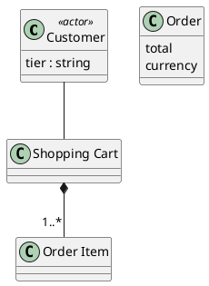

Object diagram. Stored as: entities with `instantiation` relationships and
attribute values. Conformance checks values against the type's attributes and
links against its relationships.

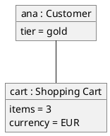

Package diagram. Stored as: scopes or containment subtrees group the class
projection; arrows summarize the lifted cross-package relationships
(`req:shop-3` here, lifted through `parent`).

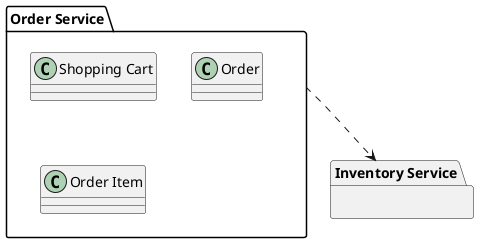

Component diagram. Stored as: «service» and «interface» entities; the lollipop
is `realization`, the socket is `dependency` toward an «interface».

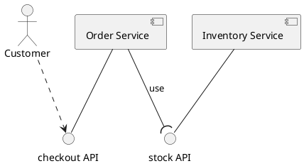

Composite structure diagram. Stored as: a component entity's children
(`parent`) as parts, connectors from relationships among the parts and
crossing the boundary.

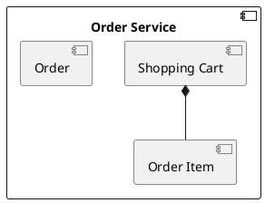

Deployment diagram. Stored as: deployment facts prose states (`req:shop-11`
and the `region` attribute it yields on `ent:shop`); on-evidence, nothing
synthesizes topology.

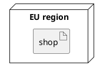

Use case diagram. Stored as: a use case view (ordered requirement members);
actors are the «actor» entities among the members' entities.

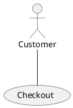

Activity diagram. Stored as: the same use case view; member order gives the
flow, failure-mode members give the branches.

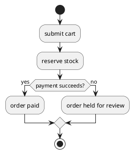

State diagram. Stored as: the derived state machine of `ent:order`, recomputed
from `transition` facets.

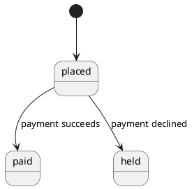

Sequence diagram. Stored as: a sequence view over the same ordered
requirements; each message is one requirement, its receiver resolved through
`realization` when the target is an «interface».

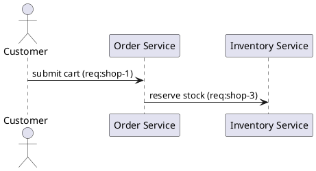

Communication diagram. Stored as: the same view, second layout, numbered
messages.

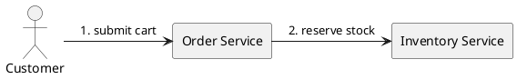

Timing diagram. Stored as: the derived state machine plus a requirement
carrying a time measure (`req:shop-10` bounds checkout confirmation at 2
seconds); on-evidence, so without measures no timing view derives, and the
lane shows only what the measure governs.

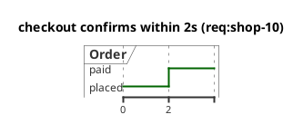

Interaction overview diagram. Stored as: the use case view as an activity frame
whose steps reference their sequence views.

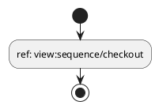

Profile diagram. No picture: jazyk has no profile machinery. Free-form judged
stereotypes on entities carry the whole of what a UML profile would declare
here.

Adjacent notations: a C4-styled rendering of the containment tree is a style
option; ER is a style option on the class projection; BPMN stays out (a
BPMN-shaped document is prose input); the KerML/SysML v2 metamodel is not
adopted (only its trace vocabulary informed the edge types); formal methods
(TLA+, Alloy) are not a stage, derived statecharts are the formal ceiling.

## How a diagram is stored

Three layers, only the first two stored:

- The semantic facts: entities, requirements, and what derives from them. The
  only editable truth.
- The view: which facts one diagram includes.
- The rendering: build output, diffable, never hand-edited, never read back;
  deleting it loses nothing.

One renderer, PlantUML, for the whole catalog, in process:

- Every view renders to `<out>/diagrams/<kind>/<slug>.puml` deterministically
  on every build, with the picture beside it as `.svg`. Rendering is the
  `plantuml-little` crate: a pure-Rust reimplementation of PlantUML with
  byte-exact SVG parity against the Java release (verified by its reference
  suite), covering every type in the catalog, with Graphviz linked as a
  prebuilt native library. No Java, no external tool, no degraded mode:
  pictures are part of the build. A surface that needs raster gets `.png`
  through an in-process SVG rasterizer (`resvg`).
- The official PlantUML native binaries (GraalVM builds per platform, no Java
  runtime) are the cross-check, not the renderer: the fixture views render
  both ways and diff in CI, so a crate gap is measured before a reader meets
  it. The crate is young; if it falls short, the native binary is the drop-in
  replacement behind the same seam.

The reading surfaces:

- The docsgen page per entity (exists today: definition, requirements with
  quotes, relationships) embeds the rendered pictures of its relevant views:
  the class neighborhood, the entity's derived state machine, the flows it
  appears in, each linking onward to related entities' pages.
- The LSP already links every entity occurrence to its docsgen page; hover
  embeds the picture of the most relevant view directly (editors render
  markdown images in hovers), with the page link beside it.
- The GUI renders its interactive projections straight from the graph and
  does not go through the files.

Geometry, layout, and styling are never stored anywhere.

A PlantUML block inside a source document is the opposite thing: input, parsed
as a `diagram` section, its obligations extracted as prose.

## Any medium

Jazyk does not assume software. Entities, requirements, views, and the
relationship types are medium-neutral, and there is no profile machinery: the
model adapts to what it reads, stereotypes are free-form judgment recorded
with provenance, and the projections take their labels from the content (the
class diagram of an organization is its org chart; a sequence view of a novel
is a scene). The graph, gates, and checks are identical in every medium. The
same kinds read:

| content | software | slide deck | company organization | romance novel |
|---|---|---|---|---|
| requirements | system obligations | content per slide | policy and process rules | narrative obligations |
| entities | services, concepts | deck, slides, elements | units, roles | characters, settings, themes |
| instances | fixtures, examples | sample data | named teams, offices | concrete scenes |
| flow views | use cases, sequences | presentation flow | processes, procedures | plot threads, dialogue scenes |
| state machines | lifecycles | (rarely) | pipelines | character arcs |
| verification | tests | render and content checks | audit checks | continuity checks |
